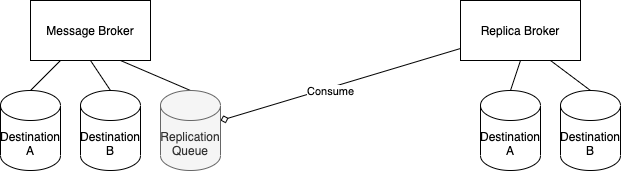
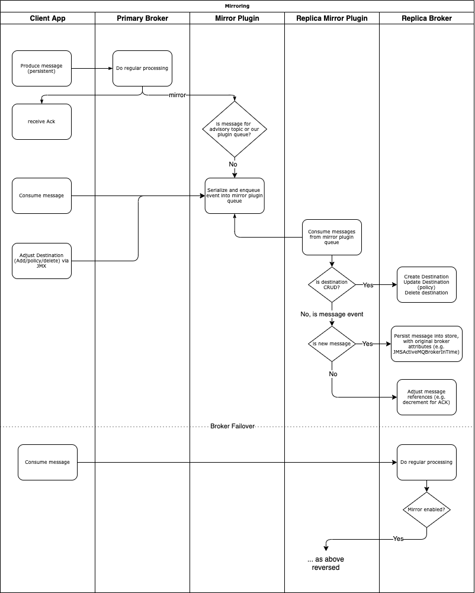

# Design: ActiveMQ Broker Replication

## Glossary

* *Active / Standby* brokers - their state with regards to the broker having acquired a file lock
* *Replica* broker - a broker that is not accepting incoming client communication and solely replicating state
* *Replica source* broker - a broker that is replicating its events

## Scope of the problem

ActiveMQ users want a way to achieve data replication across regionally disparate (>100 miles) data centres, with a particular focus on features that enable rapid Disaster Recovery. While this can be achieved today with little-to-no data loss using a geo-repli cated SQL database and the JDBC persistence for ActiveMQ, JDBC has a high negative impact on throughput and overall broker performance. The design intends to propose behaviour and some implementation details around broker replication done within the broker process, independent of the message persistence technology.
The design should have minimal impact on broker throughput, be resilient to limited WAN bandwidth, and keep a strong bias for availability.
A reference implementation can be seen in [ActiveMQ Artemis under AMQP mirrors](https://github.com/apache/activemq-artemis/blob/b34363964ff004cd19d93dad0ea295860f0f4eb6/docs/user-manual/en/amqp-broker-connections.md#mirroring). For ActiveMQ the name ‘mirrors’ and ‘mirroring’ is not used, because of the existing nomenclature for [mirror queues](https://activemq.apache.org/mirrored-queues).

## Functional Requirements

* A broker should be able to replicate its events as quickly as possible during normal processing
* A broker should be able to communicate to another broker for the purposes of consuming messages from an internal replication queue
* An administrator should be able to understand replication state
    * Replication functionality enabled
    * Replication ongoing
    * Replication delay (age of oldest unreplicated message)
    * Replication halted (replica broker cannot reach its source, replica source cannot reach replica)
* Replication should preserve message ordering (under all conditions but recovery after isolation)
* A replica source broker should have some strategies for catching up in replication delay available to the user

## Out of scope

* Event compaction (discussed in “Future improvements” section)
* Replicating of existing events, prior to enabling the plugin (discussed in “Future improvements” section)
* Replication error handling logic (discussed in “Issues and Mitigations”)

## Design Overview

Broker replication introduces the concept of a replica broker - a broker which has the purpose of replicating state from another broker. This broker:

* should do the majority of the replication work, to not impact its replica source
* will consume state from the source broker through use of a queue - as to be resilient to network delays and disconnections
* Should not accept client communication (further details below)

The replica source will have the responsibility of queuing data for the broker to replicate. This will happen:

* On any incoming message
* On any consumed message (ACK)
* On creation/deletion or policy updates for a destination
* On initial startup after enabling the plugin
* On JMS transaction events (commit, rollback, etc.)

When using this feature, it is intended that at any given point, only one of the replica or replica source is accepting incoming traffic at a given time. (We refer to this as a Hot-Warm architecture). As there is a delay between queuing the data to replicate, and the actual consumption+replication process, it is possible for the states of the replica and its source to be out-of-sync. This can lead to the possibility of duplicate messages, or out-of-order messages. While this is a real possibility even with a single broker accepting traffic during a disaster recovery failover, and the system should handle this (more details in “Issues and Mitigations”), this is ideally a rare-to-never occurring event, and allowing both brokers to accept traffic would greatly increase this possibility. Thus, the replica broker should have its [Transport Connectors](https://activemq.apache.org/configuring-transports) disabled. We can call the process of disabling connectors on one broker and enabling them on another the classic DR term, **failover**.

As this feature is not mandatory for all users, and Business Continuity Plans differ for many companies, this feature needs to be configurable. The configurable functionality can be encapsulated in a broker plugin, and users can then configure via the plugins APIs, or through the xbean generated Spring XML.
The plugin implementation will not affect transport connector configuration, thus allowing users to choose a Hot-Hot architecture with both brokers online, as it is ultimately their choice. The plugin is designed so that the replica broker can take over serving traffic, irrespective of its ability to reach the replica source.

Broker plugins are a formal concept in the ActiveMQ codebase (docs: https://activemq.apache.org/developing-plugins) that give the implementer access to core aspects of the broker functionality. The canonical example is the [LoggingBrokerPlugin](https://github.com/apache/activemq/blob/d48cf3758312a25122508854946c399a2e6f6f69/activemq-broker/src/main/java/org/apache/activemq/broker/util/LoggingBrokerPlugin.java), which adds (synchronous) logging logic before each inherited action is performed.
This replication plugin will add an *asynchronous* call after every inherited action that affects replication, to generate and store the action as an event to be replicated. The asynchronous nature of this action will be managed by an ActiveMQ [TaskRunner](https://activemq.apache.org/maven/apidocs/org/apache/activemq/thread/TaskRunnerFactory.html). (configurable as a dedicated task runner - defaulting to true). If this asynchronous task fails, the plugin will attempt to create a copy of the relevant event enqueued on a replication DLQ for later inspection. If this second task fails, the error will be logged and the event discarded. See “Event general failure” for an expanded discussion on this topic.

**Event Selection**
Events will be replicated only if they are durable destinations, and not advisory messages.

**Event Serialization**
Events will be serialized through the OpenWire protocol, with metadata such as the event type and payload.
An alternate could be to use AMQP and its connection implementations (e.g. [Proton Receiver](https://github.com/apache/qpid-proton-j/blob/main/proton-j/src/main/java/org/apache/qpid/proton/engine/Receiver.java)s) as Artemis has, but given ActiveMQ 5.X does not offer the same level of existing AMQP broker connection support, the more integrated OpenWire format is recommended.

**Replication Queue**
Events will be stored in a replication queue denoted “replication-plugin-queue-<generated id>”. We use a prefix+id to allow for future possibilities of multiple replication queues. This queue will not be visible in the ActiveMQ web console, similar to Advisory destinations. For visibility into replication failures, a “replication-plugin-dlq-<generated id>” will be created. The Replication queues may be stored in a different storage directory if multi-KahaDB is used, and a configuration option should support this. This queue should support the authorization policy element for configuring auth.

**Plugin Initialization**
During broker startup, the plugin will be “started”. The following tasks should occur if the broker is a replica source:

1. The replication queue/DLQ should be created if they don’t exist
2. All existing destination definitions should be queued for replication (destination create events are idempotent)

The following tasks should occur if the broker is a replica

1. Attempt to establish a connection to the source. If a connection is successful, begin consuming from the replication queue. Ensure the transport for the source is [FailoverTransport](https://activemq.apache.org/failover-transport-reference.html) to leverage existing reconnection logic 

**Plugin Metrics**

* DLQ size
* ReplicationQueue size
* Age of oldest message in ReplicationQueue
* Plugin connection status

**Directionality**
We have thus far talked about the replica and replica source assuming a one-way relationship between the two. In reality the plugin should ideally be configured for bi-directional replication. This way, at any given point there may be only one broker with disabled connectors and ongoing replication, but in the case of a disconnection from the replica source, once it comes back online the former replica (now replica source to the original broker), will replicate messages into its own data store. (see “Out-of-order” messages on the consequences of this). This way, no “state reconciliation” must happen, and no messages are lost once they are ACK’d by the broker.

## Issues and Mitigations

### Network Disconnection and Delays

**What should happen if the brokers disconnect?**
As per the “Plugin Initialization”, the connection establishment should be repeated on a 5 second† interval until shutdown. Once reconnected the polling behaviour should resume.
An alternative could be to block until reconnection, but if this was desired behaviour, the design would affect the availability of the two brokers.

**What should happen after the reconnection?**
If the replica reconnects and there are a ton of messages on the replica source broker, it may be hard or impossible for the replica to “catch up” (similarly, one might imagine this if the production rate to the replica source exceeds that of the throughput capacity for the replica). To detect this delay, the replica source broker should monitor the age of the oldest message in the replication. Action is required if this age exceeds a [configurable] threshold and the replica is still reachable from the source (i.e. there is still an active consumer on the replication queue)‡. There are three approaches to mitigating this, handled on the replica *source* side:

* Enter Producer Flow Control (PFC) on all destinations until the replication queue reaches an acceptable size (PFC itself can block as above)
* Block all connections until the replication queue reaches an acceptable size
* Discard old messages

These three options pose significant implications on the Business Continuity Plans for the broker user, and are not one-size-fits-all. The initial implementation will focus on flow-control as a way to alleviate broker replication load - either allowing for more resources to the replica client, or reducing the rate of message delivery. The replica consumer should ideally not be throttled, as it has to always do its best to remain up-to-date. (future improvement discussed in “Replication Queue Destination Policies” below) It’s also important to note that in any of these strategies, action should only be taken if the connection to the other broker can be verified as intact, otherwise we would impact availability unnecessarily. Thus in our initial design, if the replication queue surpasses the “turn-PFC-on” threshold, but the replica is unavailable, no action should be taken.

**Blocking/Stalling**
PFC is the default strategy for reducing broker load, but it is also completely ignorable if a producer uses async sends (i.e. doesn’t wait for the broker to ACK its message production). In this situation, only full connection blocking provides load-lessening guarantees. This approach is avoided for the first implementation because it impacts availability, of which this design is aiming to prioritize, and because of its lack of precedent in other areas of ActiveMQ.

**Discarding**
A final option considered, but omitted from the first implementation, is to add a TTL for the replicated messages, and discard them if they surpass a certain age. This operates under the assumption that data that is that delayed is not worth replicating. But the primary desire for replication as part of a data compliance requirement is not met with this solution. Users will always have the option to purge their replication queue to manually perform this action.

*† N.B. ideally here, we mimic the NoB reconnection behaviour
‡ We can use the same view as the MBean `org.apache.activemq:type=Broker,brokerName=<source>,destinationType=Queue),destinationName=replication-plugin-queue`*

### Duplicate Messages

Because replication is asynchronous, it is possible for a message to have propagated to the replica while its ACK remains on the replica source. In this case consumers from the replica broker may receive a message that has already been consumed. There is no way to avoid this problem. However, the plugin should have a facility to handle ACKs for messages that don’t exist. 
A debug-level message will be logged.

### Out-of-order messages

In the reasoning above for bi-directional replication, it was noted that there will be no message loss as a positive benefit, but the negative consequence is a broker could receive messages out-of order. For example:

1. Producer A sends 10 messages to Broker 1 (replica source)
2. Broker 2 (replica) replicates the first 5 messages to its own storage
3. A network isolation event happens, Broker 2’s transport connectors start and we perform a failover.
4. Producer A sends 10 more messages, via failover transport, to Broker 2. 
    Now Broker 2 contains messages 1-5, 11-20, while Broker 1, unreachable contains messages 1-10.
5. Consumer A reads 15 messages from Broker 2.
    Broker 2 contains messages 15-20, ACKs 1-5, 11-15. Broker 1, unreachable contains messages 1-10.
6. The network connection between Broker 1 and Broker 2 is re-established. Broker 1 ‘catches up’
    Broker 1 reads messages 11-15, ACKs 1-5, 11-15.
    Broker 1 contains messages 5-10, 15-20. Broker 2 contains messages 15-20, ACKs 1-5, 11-15. 
7. Broker 2 reads messages 5-10 from Broker 1. The states are in sync.

No additional error handling needs to be done by the broker. We can imagine an alternate failure scenario:
1-5 as above.

1. The network connection between Broker 1 and Broker 2 is re-established. Immediate failover again, back to the original Broker 1 (replica source) and Broker 2 as replica.
    Broker 1 contains messages 1-10. Broker 2 contains messages 15-20, ACKs 1-5, 11-15.
2. Consumer A reads 15 messages from Broker 1. This happens before the replication from Broker 2.
    Broker 1 is now empty as it only knew of 10 messages.
    Consumer A has read messages 5-10 twice. It may take business action based on the fact that it could not consume 15 events.
3. Broker 1 catches up with Broker 2 replication.
    Broker 1 now contains messages 15-20. The ACKs for messages 1-5 are dropped. The ACKs for 11-15 are correctly applied. Broker 2 contains messages 15-20, ACKs 1-5, 11-15.
4. Broker 2 catches up with Broker 1 replication.
    Broker 1 now contains messages 15-20. Broker 2 still contains messages 15-20, as it has read messages 5-10, dropped the ACKs for 1-5, read the ACKs for 5-10.

In this second scenario, we illustrate the consequences (out of order + duplicates) if failover/failback happens too early.
Thus it is recommended only to failover if the replica has an empty replication queue.

### Message Timeouts / Schedules / Timestamps

Considering it’s expected that a message is replicated across both brokers, the message should ideally have the same functionality. i.e. if the message has a TTL and would expire in the replica source, the replica should have this as well. But given that there is a delay in the entire replication process, the TTL could be adjusted to account for this (n.b. out of scope, see below)
Scheduled messages allow messages to be sent at a later date. Given this is not supported by all persistence layers (JDBC), not always a recommended approach (extra logic/overhead on the broker), and additional effort to test, we will omit handling this to begin.
Broker timestamps may be set by the TimeStampPlugin. We will assume that broker operators have kept the two instances in sync and will not do anything to adjust timestamps.

### Storage Capacity

Because the basic design creates full copies of the message payloads, it’s expected that broker storage will fill up much faster than under regular operations. A recommended mitigation is to provision two storage volumes, and use multi-kahadb to store the replication queue on another volume, separate from the regular broker. If possible, this could be handled under-the-hood by the plugin through some configuration (e.g. `replication-storage-path=“/kahadb-replication/”`)

### Event generation failure

Events may fail to generate for any number of issues, e.g. expired broker connection context, full replication storage, full storage, transient issues). The proposed mitigation path is:

1. Try to generate the event and enqueue on the replication queue
2. If processing fails, enqueue back into the replication queue with a retry counter attribute.
    Keep track of the messageId (e.g. in an in-memory map). When processing ACKs, double-check before generating another event that the message ID is not present in this failed-event map, so that we don’t replicate ACKs before messages.
3. If enqueuing on the queue fails, or retry counter > 0, add to the replication DLQ
4. If enqueuing on the DLQ fails, log an exception and carry on

## Metrics and Monitoring

For users to monitor this solution the following are proposed:

* Replication Enablement State: YES/NO  
    *Based on plugin being present in settings*
    **user action**: Replication needs to be enabled if not  
* Replication connection state (CONNECTED, DISCONNECTED)  
    *On the replica side, is the connection established*  
    *On the replica source, is there a consumer on the replication queue*  
    **user action**: connection should be checked if disconnected for enough time
* Replication queue stats (e.g. JMS Endpoint stats)  
    *`JMSEndpointStatsImpl` values in broker - `messageCount`/`messageWaitTime`/`messageRateTime  
    MemoryPercentUsage `based on a version of `cursorMemoryHighWaterMark`*  
    **user action*: adjust usage pattern if any values exceed based on what one measures as impactful  
    **internal action**: broker-wide PFC if memory usage goes high, or count exceeds threshold
* Replication queue age of oldest-replicated-message  
    *Browse first message for* *JMSActiveMQBrokerInTime or brokerInTime  
    **admin action**: If replication expected and age increasing, verify system is healthy (broker and broader applications). Double check with connection state
* Replica broker age of last-replicated-message  
    *Set a `TimeStatisticImpl` value when processing messages on the replica broker*  
    **admin action**: If replication expected and age increasing, verify system is healthy (broker and broader applications). Double check with connection state

## Unanswered Questions

### Message storage via reference counting

The proposal discusses replicating broker events in a highly naive fashion - take the incoming message data and create a full copy of the message for the replica broker to consume. This of course is 2x storage usage, and in particular creates a failure point around very large messages.
Would it be possible to optimize by referring only to the message Ids in KahaDB?
It certainly isn’t possible for new messages, but there should be no need to send a full message for ACK/Removal/Expiration of messages, [MessageAck](https://github.com/apache/activemq/blob/main/activemq-client/src/main/java/org/apache/activemq/command/MessageAck.java) should be enough.

### **Connection Stalling**

The Producer Flow Control docs (https://activemq.apache.org/producer-flow-control) mention:

> Though a client can ignore the producer ACKs altogether and the broker should just stall the transport if it has to for slow consumer handling; though this does mean it’ll stall the entire connection.

Which implies there is a method that can be used to stall the connection. What is this mechanism? How can a plugin tap into this? Or does this require deeper broker integration?

### JMX

What is the best way to add JMX support? Just as network connectors do:
https://github.com/apache/activemq/blob/d48cf3758312a25122508854946c399a2e6f6f69/activemq-broker/src/main/java/org/apache/activemq/network/NetworkConnector.java#L212

### **Invisible Queue**

The replication queue doesn’t really need any interaction from the user, so the question comes up:
a. Should this queue be made invisible to the user (web console + JMX)
b. Can the queue be purged in an emergency situation (JMX)

### **Threading Model**

If we choose to perform the replication work asynchronously, how can that work?

* Does the plugin create its own single-threaded Java Executor?
* Is it safe to use the broker task runner? Could load affect the scheduling of replication?
* Are there multi-threaded optimizations or lessons to be learned from Artemis AMQP mirrors that could be applied here?

### **Configuration “Drift”**

An eventuality of the system is that two broker instances would be in different configuration states, and we would want to align the systems. In a minimal permission system, the replica broker would only have access to the replication queue of the primary broker. Is there some way to quickly send the destination upsert events from the primary to the replica? Or is the best and only way to do this, to have the replica list destinations from the primary, and generate/consume its own upsert data. → If we could insert into the head of the replication queue on the primary, this would accomplish this, but that’s a weird concept.

## Test Scenarios

1. If a queue is created, the replica has the same queue, with the same destination policy
2. If a queue has its destination policy updated, the replica will have the destination policy updated
3. If a message is sent to a queue, it is replicated in the replica. Same with a message ack
4. If a message is sent to a topic with a durable subscription, it is replicated
5. If a message is sent to 2+ durable subscriptions on a topic, and one of those subscribers consumes the message, the message is still available on the other subscriptions on the replica
6. If a message is sent to a virtual destination, the same destination configuration will have the same message on the replica
7. If a message is sent with a TTL, it is replicated and expires accounting for replication delay
8. If a queue is emptied (purged), the replica queue is also purged
9. If a JMS transaction is created and unfinished over many commands, the replica broker does not have the results of that transaction.
    The replica broker can receive the COMMIT for that transaction directly and the events are committed.
    This replication returns to the primary
10. If the replication is not bi-directional, events are not replicated from a replicating broker to its replica source.

## Future Improvements

**Existing Events**
A major drawback of the Artemis implementation is that existing messages that have been persisted by the broker, prior to enabling the AMQP mirror are not replicated. A similar drawback is foreseeable in this implementation, given that the design is to intercept events as they happen.
To address this, a startup process could be added to the plugin, which would scan the DB, and generate events for all the existing messages. This is similar to the startup process of journaledJDBC ([code link](https://github.com/apache/activemq/blob/ae777e9571820bca81d6ae09090da945d3200d0f/activemq-jdbc-store/src/main/java/org/apache/activemq/store/journal/JournalPersistenceAdapter.java#L291) + [link](https://github.com/apache/activemq/blob/ae777e9571820bca81d6ae09090da945d3200d0f/activemq-jdbc-store/src/main/java/org/apache/activemq/store/journal/JournalPersistenceAdapter.java#L537)).
It’s recommended that this be a follow-up implementation, due to the orthogonal nature of the problem and a necessity to either access KahaDB internals, or build out additional APIs for journal scanning.

**Types of Events**
For a first take at this feature’s implementation, any durable destinations and their data will be replicated on the replica broker. Configuring this list of destinations, or even adding non-durable destinations should be relatively easy to add in the future (add configuration, do filtering), but are excluded to keep the test space simple.

**Replication Queue Destination Policies**
https://activemq.apache.org/per-destination-policies are possible for normal destinations, so it is feasible we could add some level of configuration on the replica queue to allow for optimization, and have this exposed via plugin configurations

**JMS Transactions**
After failover, there may be incomplete JMS transactions. It may be desirable to simply drop these transactions as commits might never come. This could be configurable - although, the initial version of this plugin should have documentation on ways to handle this.

**Replicating Scheduled Messages**
As mentioned above, scheduled messages will not be replicated in the initial version of this plugin. Enhancements could be made to that feature to allow for replication of those messages.

**Replicating Messages with Timeouts**
As mentioned above, users may desire TTLs to increase with the replication time as an added factor. There is no “sensible default” value, so this is not part of the initial implementation

**Multiple Replication Destinations**
If the behaviour of one of the destinations to replicate is greatly different than that of another (e.g. very busy queue compared to other queues), there is a noisy neighbour problem for most destinations. A mitigation would be to have multiple replication queues, that could be managed by selectors or similar.

**Compaction**
If there are a large volume of messages to replicate, it’s highly likely if the replica source is just “busy” that many of the messages to replicate would already have been consumed by a consumer. An open question exists if these messages could be “compacted” and dropped from the queue if they are already consumed. This could either be an active process, e.g. scan messages and check if they exist in the store, or a passive process, e.g. intercept when the message is consumed by the replica and reply with a no-op if there are no references to it within the journal.

**Smart “Failover“**
Currently failover is going to be a separate series of actions from the plugin. Because the actions are defined (starting transport connectors), this could be a JMX command. In making it a top-level concept, “smartness” could be added to do things such as: rolling back uncommitted JMS transactions on the replica, resetting TTLs, purging DLQs + discarded messages on the replica source, etc.

**Mystery ACK ‘holding queue’**
If messages arrive out-of-order for whatever reason, an ACK may arrive for a message that no longer exists. Rather than simply ignoring this ACK, this message could be held in a ‘holding queue’ and expire after a certain period of time. This would ensure that a delayed message (e.g. one that is reprocessed on the replica source) could correctly arrive and be ACK’d in the replica’s state.
